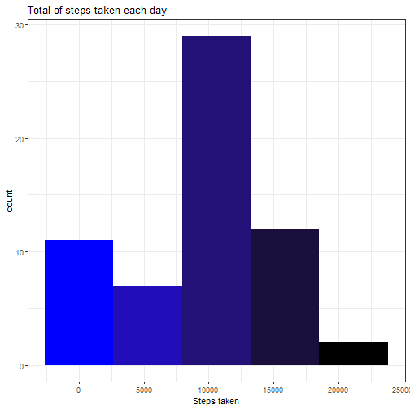

<pre class="knitr r">knitr::opts_chunk$set(echo = TRUE)
</pre>

###Loading and processing the data

First we will load the data from the working directory (previously downloaded).

<pre class="knitr r">#Reading the data
data &lt;- read.csv(&quot;C:/Users/arturo/Desktop/curso de coursera/Data Science/Reproducible Research/activity.csv&quot;,sep = &quot;,&quot;,header = TRUE)

#Transforming date into date class object
data$date &lt;- as.Date(data$date)
head(data)
</pre>

<pre class="knitr r">##   steps       date interval
## 1    NA 2012-10-01        0
## 2    NA 2012-10-01        5
## 3    NA 2012-10-01       10
## 4    NA 2012-10-01       15
## 5    NA 2012-10-01       20
## 6    NA 2012-10-01       25
</pre>

###What is the mean of the total number of steps taken per day?

For this part of the assignment, you can ignore the missing values in the dataset.

First we will Calculate the total number of steps taken per day.

<pre class="knitr r">library(dplyr)
steps_taken &lt;- data %&gt;%
        group_by(date) %&gt;%
        summarise(steps = sum(steps,na.rm = TRUE))
print(steps_taken)
</pre>

<pre class="knitr r">## # A tibble: 61 x 2
##    date       steps
##    &lt;date&gt;     &lt;int&gt;
##  1 2012-10-01     0
##  2 2012-10-02   126
##  3 2012-10-03 11352
##  4 2012-10-04 12116
##  5 2012-10-05 13294
##  6 2012-10-06 15420
##  7 2012-10-07 11015
##  8 2012-10-08     0
##  9 2012-10-09 12811
## 10 2012-10-10  9900
## # ... with 51 more rows
</pre>

<pre class="knitr r">rows &lt;- nrow(steps_taken)
</pre>

We can see that there is **<code class="knitr inline">61</code>** days in the dataset corresponding to october and november.

Now we will make a histogram with the total number of steps taken each day

<pre class="knitr r">library(ggplot2)
#Creating a pallete of colors
BB &lt;- colorRampPalette(c(&quot;Blue&quot;,&quot;black&quot;),space=&quot;Lab&quot;)

#Plotting
g &lt;- ggplot(data = steps_taken,aes(x=steps))
        p = g + geom_histogram(bins = 5,fill = c(BB(5))) +
                ggtitle(&quot;Total of steps taken each day&quot;) +
                xlab(&quot;Steps taken&quot;) + theme_bw()
print(p)
</pre>

We can see that the max amount of steps taken in all days is around the ten thounsand. Let's see what is the mean and the median of the total number of steps taken each day.

<pre class="knitr r">#Calulating the mean
steps_mean &lt;- mean(steps_taken$steps,na.rm = TRUE)
        steps_mean_round &lt;- as.numeric(round(steps_mean,0))

#Calculating the median
steps_median &lt;- median(steps_taken$steps,na.rm = TRUE)
</pre>

So, the mean of the steps taken each day is **<code class="knitr inline">9354</code>** and the median is **<code class="knitr inline">10395</code>**, like we saw before with the histogram, they are around the ten thousand of steps each day.

###What is the average daily activity pattern?

Let's make a time series plot of the average number of steps taken across all days.

So, First we calculate the average of steps taken each day.

<pre class="knitr r">steps_average &lt;- data %&gt;%
        group_by(interval) %&gt;%
        summarise(average = mean(steps,na.rm = TRUE))
print(steps_average)
</pre>

<pre class="knitr r">## # A tibble: 288 x 2
##    interval average
##       &lt;int&gt;   &lt;dbl&gt;
##  1        0  1.72  
##  2        5  0.340 
##  3       10  0.132 
##  4       15  0.151 
##  5       20  0.0755
##  6       25  2.09  
##  7       30  0.528 
##  8       35  0.868 
##  9       40  0     
## 10       45  1.47  
## # ... with 278 more rows
</pre>

Then we make the time series plot

<pre class="knitr r">T &lt;- ggplot(steps_average,aes(interval,average))
       t = T + geom_line(colour = BB(288)) +
               ggtitle(&quot;Average of steps taken by interval of 5-minutes&quot;)+
               xlab(&quot;Interval of 5-minutes&quot;)+ylab(&quot;Average of steps taken&quot;)+ theme_bw()

print(t)
</pre>

Which interval has the maximun amount of steps taken across all days?

<pre class="knitr r">#Finding the Max steps into the interval and the amount of that max steps
Max_interval &lt;- steps_average$interval[which.max(steps_average$average)]
Max_steps &lt;- round(steps_average$average[which.max(steps_average$average)],0)

#Creating the hour to putting the inline code
library(lubridate)
min &lt;- minutes(Max_interval)
per &lt;- period_to_seconds(min)
hour_day &lt;- seconds_to_period(per)
hour_day2 &lt;- as.POSIXct(hour_day,origin = &quot;2020-02-02 UTC&quot;,tz=&quot;GMT&quot;)
hour_day3 &lt;- format.POSIXct(hour_day2,format = &quot;%r&quot;)
</pre>

So, the Interval with the maximun amount of steps taken across all days is **<code class="knitr inline">835</code>** which means that is at **<code class="knitr inline">01:55:00 p.m.</code>** Having an average of **<code class="knitr inline">206</code>** steps taken across all days.

###Imputing missing values

Now we will calculate and report the total number of missing values in the data set.

<pre class="knitr r">miss_steps &lt;- sum(is.na(data$steps))
</pre>

We can see that there's **<code class="knitr inline">2304</code>** missing values.

Now, we need to fill those missing values. To do that we will take the average of steps taken in each interval and then fill the data with those values.

<pre class="knitr r">fill_NA &lt;- data

for (i in 1:nrow(fill_NA)) {
        if(is.na(fill_NA$steps[i])) {
#Find the index value for when the interval marches the average
                find_NA &lt;- which(fill_NA$interval[i] == steps_average$interval)
#Assign the value to replace the NA
                fill_NA$steps[i] &lt;- steps_average[find_NA,]$average
        }
}

#Making sure that the date variable is still a date class object
fill_NA$date &lt;- as.Date(fill_NA$date)

#testing that the result has no NA's
test_fill_NA &lt;- is.na(fill_NA)
summary(test_fill_NA)
</pre>

<pre class="knitr r">##    steps            date          interval      
##  Mode :logical   Mode :logical   Mode :logical  
##  FALSE:17568     FALSE:17568     FALSE:17568
</pre>

We can see that there is no more NA's in the dataset. 

Let's see how are the steps taken each day in the new data.

<pre class="knitr r">library(dplyr)
steps_taken_fill &lt;- fill_NA %&gt;%
        group_by(date) %&gt;%
        summarise(steps = sum(steps))
print(steps_taken_fill)
</pre>

<pre class="knitr r">## # A tibble: 61 x 2
##    date        steps
##    &lt;date&gt;      &lt;dbl&gt;
##  1 2012-10-01 10766.
##  2 2012-10-02   126 
##  3 2012-10-03 11352 
##  4 2012-10-04 12116 
##  5 2012-10-05 13294 
##  6 2012-10-06 15420 
##  7 2012-10-07 11015 
##  8 2012-10-08 10766.
##  9 2012-10-09 12811 
## 10 2012-10-10  9900 
## # ... with 51 more rows
</pre>

<pre class="knitr r">rows_fill &lt;- nrow(steps_taken_fill)
</pre>

We can see that there's still **<code class="knitr inline">61</code>** days in the dataset corresponding to october and november.

Now we will make a histogram.

<pre class="knitr r">library(ggplot2)
#Creating a pallete of colors
GB &lt;- colorRampPalette(c(&quot;green&quot;,&quot;black&quot;),space=&quot;Lab&quot;)

#Plotting
N &lt;- ggplot(data = steps_taken_fill,aes(x=steps))
        n = N + geom_histogram(bins = 5,fill = c(GB(5))) +
                ggtitle(&quot;Total of steps taken each day&quot;) +
                xlab(&quot;Steps taken&quot;) + theme_bw()
print(n)
</pre>

We can see that the amount of steps taken each day is around the ten thounsand steps each day. Let's see what is the mean and the median of the total number of steps taken each day.

<pre class="knitr r">#Calulating the mean
steps_mean_fill &lt;- mean(steps_taken_fill$steps)
        steps_mean_round_fill &lt;- as.numeric(round(steps_mean_fill,0))

#Calculating the median
steps_median_fill &lt;- median(steps_taken_fill$steps)
        steps_median_round_fill &lt;- as.numeric(round(steps_median_fill,0))
</pre>

So, the mean of the steps taken each day is **<code class="knitr inline">10766</code>** and the median is **<code class="knitr inline">10766</code>**, like we saw before with the histogram, they are around the ten thousand of steps each day.

Looks like there's a slightly difference between the first data and the filled one. But let's make the comparison.

<pre class="knitr r">#Let's see the plots
print(p)
</pre>

<pre class="knitr r">print(n)
</pre>

There is a difference in the first bar but the the max amount of steps taken in all days is still around the ten thousand.

The mean and median of the first data are **<code class="knitr inline">9354</code>**,  **<code class="knitr inline">10395</code>**, and the mean and median of the filled one are **<code class="knitr inline">10766</code>**,**<code class="knitr inline">10766</code>**. Either the mean and the median of the filled one are higher than the original.

###Are there differences in activity patterns between weekdays and weekends?

Let's see the trend of the steps taken by days but, this time we will make difference between weekdays and weekends.

First, let's create a variable to identify every day of the week

<pre class="knitr r">fill_NA$weekdays &lt;- weekdays(fill_NA$date)
head(fill_NA)
</pre>

<pre class="knitr r">##       steps       date interval weekdays
## 1 1.7169811 2012-10-01        0    lunes
## 2 0.3396226 2012-10-01        5    lunes
## 3 0.1320755 2012-10-01       10    lunes
## 4 0.1509434 2012-10-01       15    lunes
## 5 0.0754717 2012-10-01       20    lunes
## 6 2.0943396 2012-10-01       25    lunes
</pre>

Now that we know the weekdays of every day, let's separate them into weekdays and weekend.

<pre class="knitr r">#First categorize the normal weekdays
fill_NA$wknd &lt;- fill_NA$wknd &lt;- &quot;Weekday&quot;

#Now, determine the weekend days
fill_NA$wknd[fill_NA$weekdays %in% c(&quot;sábado&quot;,&quot;domingo&quot;)] &lt;- &quot;Weekend&quot;
</pre>

Now that we have the days of the week categorized, let's see the average between them.~~(sorry for the spanish, don't know why that appear like that)~~

<pre class="knitr r">week_average &lt;- fill_NA %&gt;%
        group_by(wknd,interval) %&gt;%
        summarise(average = mean(steps))
print(week_average)
</pre>

<pre class="knitr r">## # A tibble: 576 x 3
## # Groups:   wknd [2]
##    wknd    interval average
##    &lt;chr&gt;      &lt;int&gt;   &lt;dbl&gt;
##  1 Weekday        0  2.25  
##  2 Weekday        5  0.445 
##  3 Weekday       10  0.173 
##  4 Weekday       15  0.198 
##  5 Weekday       20  0.0990
##  6 Weekday       25  1.59  
##  7 Weekday       30  0.693 
##  8 Weekday       35  1.14  
##  9 Weekday       40  0     
## 10 Weekday       45  1.80  
## # ... with 566 more rows
</pre>

Let's make a plot to see the difference between weekdays and weekend

<pre class="knitr r">W &lt;- ggplot(week_average,aes(interval,average))
        w = W + geom_line(colour=c(BB(288),GB(288)))+ facet_grid(wknd~.)+
                ggtitle(&quot;Steps taken by weekdays&quot;)+xlab(&quot;Steps taken&quot;)+
                theme_bw()

print(w)
</pre>

        
We can see that in average the trend of the weeknds is a little bit higher than the weekdays.

#THE END
